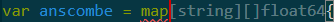
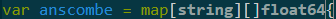

# Review of AI Use In Code Generation and AI Assisted Programming

This review aims to showcase some of the ways that AI can be used in generating and making edits to existing code as well as talk about some of the shortcomings of such approaches.

## Table of Contents
- [Introduction](#introduction)
- [Usage](#usage)
- [Automated Code Generation](#automated-code-generation)
- [AI Assisted Programming](#ai-assisted-programming)
- [AI Generated Code](#ai-generated-code)
- [Observations](#observations)
- [Summary and Recommendations](#summary-and-recommendations)

## Introduction

In this review we will be looking into three different ways that AI can be used in programming for a program that I previously created for an assignment for MSDS 431 class. The original assignment, which was about using Go for statistical analysis on The Anscombe Quartet can be found [here](https://github.com/hamodikk/goforstats).

First, I will share a brief example of how one can use automated code generation while writing code. Second, I will use Github Copilot to revise the original code I have created to get recommendations on what can be improved in the original data. Lastly, I will use ChatGPT to generate the Go code for a program with similar function as that of the original code.

The Anscombe Quartet, developed by Anscombe (1973), is a set of four data sets with one independent variable x and one dependent variable y. Simple linear regression of y on x yields identical estimates of regression coefficients despite the fact that these are very different data sets. The Anscombe Quartet provides a telling demonstration of the importance of data visualization. Here is a plot of the four data sets generated from an R program in Miller (2015):


The programs, both original and AI generated/edited, utilizes the Go stats package Montana Flynn. You can find information on examples and installation [here](https://github.com/montanaflynn/stats)

## Usage

For any of the generated or original code, first clone the repository:
```bash
git clone https://github.com/hamodikk/genprogramming.git
```
Change directory to any of the code, whether the original or AI generated:
```bash
cd <path/to/folder/ChatGPT_code>
```
Use the following command to run the program:
```bash
go run .\main.go
```

Here is how you can test and benchmark the code:
```bash
# Test the code to compare coefficient of regression between Python and R against the Go code
go test -v

# Benchmark the code to obtain execution times of the Go code
go test -bench=.
```

## Automated Code Generation

This method utilizes Github Copilot on VSCode. Copilot has automated code generation assistance, which when prompted, autocompletes certain code. One example is based on the [main.go](ChatGPT_code/main.go) program generated by ChatGP:

- The code before recommendation:



- The code after recommendation is implemented by simply pressing Tab:



Note that the anscombe map includes the data as such:
```go
var anscombe = map[string][]float64{
	"x1": {10, 8, 13, 9, 11, 14, 6, 4, 12, 7, 5},
	"x2": {10, 8, 13, 9, 11, 14, 6, 4, 12, 7, 5},
	"x3": {10, 8, 13, 9, 11, 14, 6, 4, 12, 7, 5},
	"x4": {8, 8, 8, 8, 8, 8, 8, 19, 8, 8, 8},
	"y1": {8.04, 6.95, 7.58, 8.81, 8.33, 9.96, 7.24, 4.26, 10.84, 4.82, 5.68},
	"y2": {9.14, 8.14, 8.74, 8.77, 9.26, 8.1, 6.13, 3.1, 9.13, 7.26, 4.74},
	"y3": {7.46, 6.77, 12.74, 7.11, 7.81, 8.84, 6.08, 5.39, 8.15, 6.42, 5.73},
	"y4": {6.58, 5.76, 7.71, 8.84, 8.47, 7.04, 5.25, 12.5, 5.56, 7.91, 6.89},
}
```

However, the recommendations made did not try to complete the entire data, rather just recommend potential types for the map. This requires additional input of the data into the map.

## AI Assisted Programming

AI assisted programming utilizes the Github Copilot chat function on VSCode. This allows the user to use natural language for prompts in order to generate new code or edit existing code. Copilot also allows the user the implement the suggested changes by simply clicking a button. I will talk about some of the prompts I gave and the recommended changes Copilot has made, but you can also look at the chat history in the form of a JSON file [here](Copilot_code/Copilot_chat_session.json). Additionally, the Go code with recommended edits implemented can be found [here](Copilot_code/main.go) as well as the test and benchmarking code [here](Copilot_code/lin_reg_test.go).

The following are the prompts, followed by the recommendations provided by Copilot. I have implemented all of the recommendations provided.

1. "Can you look over my code and see if there are any revisions that could improve the code"

Copilot recommended the following improvements:

- More descriptive error handling
- More descriptive variable naming
- Comments to explain the logic of the functions
- Combine operations to reduce the number of iterations

The recommendations are followed by a code snippet and a report of the changes made, as follows:

**Changes made:**

- Improved the error message for empty input.
- Renamed regressiondata to regressionData for consistency with Go naming conventions.
- Used a range loop with _ to iterate over regressionData for better readability.
- Added a comment to explain the purpose of the function.
- Combined the calculation of sumXY and sumXX within the loop to reduce the number of iterations.

2. "What specific improvements should I prioritize?"

Copilot suggested that I prioritize error handling, code readability and consistent formatting. It provided a code snippet with further changes, which I implemented.

3. "Could you revise my current file one more time and recommend any improvements"

This final prompt based on main.go returned a similar response, recommending similar improvements. However, it provided changes and instead of providing a code snippet, it showed the entire main.go code to show all the changes.

I also prompted Copilot to recommend changes to the test file to match the changes made on the main.go file. It was able to provide some changes to keep the files consistent in terms of nomenclature.

Following these prompts, I also utilized the Copilot Edits. This allowed me to include multiple files and use natural language to make edits in my code. I included both my main.go file as well as lin_reg_test.go and asked it to match the nomenclature between the two files as I wasn't initially satisfied with the changes made using the Copilot Chat function. The difference with Copilot Edits is that it makes the changes directly instead of making recommendations, and it is up to the user to accept or decline the changes made.


## AI Generated Code

For this method, I used the LLM-based software [ChatGPT](https://chatgpt.com/) and prompt engineering in order to generate a Go code that functions similarly to the original code. Similar to Copilot, ChatGPT takes natural language prompts as input in any topics of interest and provides answers. In my use case, I provided it with information about the previous assignment and asked it to generate the code. I will walk through my prompts and thought process for each prompt, but I have also included the text file of the [chat history](ChatGPT_code/Go%20Linear%20Regression%20Approach.txt).

Following is a step-by-step approach I took in generating the Go code:

### Establish the Baseline for Future Prompts

Here, I gave the ChatGPT session the initial information that would be necessary to set the stage. The LLM agents perform much better when dealing with specific situations, so the more information I can provide before asking for a response, the better my initial results will be.

Prompt:
> Assume that you are a data scientist. The company you work for wants to see if it is plausible to limit the programming languages they use. They want you to test Go statistics package (https://pkg.go.dev/github.com/montanaflynn/stats) to check it's accuracy and utility. Your job is to write a Go program that performs linear regression on The Anscombe Quartet and produce estimated linear regression coefficients. The two files expected from you are the program that performs the linear regression and the test file that performs unit tests and benchmarking.
>
> Before we generate a code, take a step-by-step approach to list how you can approach this programming task. After that, I could also provide you similar programs generated in Python or R as needed before we generate code.

In the prompt above, there are certain methods used to set the stage:

- Specify the perspective

Specifying that the LLM agents perspective as a data scientists helps curate the future answers we get from a data scientists point of view

- Top-to-bottom goals

Starting from the top layer, we give the agent the goals of the company. This is followed by a more specific goal, which is using a specific Go statistics package and check its accuracy. Later, we get even more specific by asking the agent to perform linear regression on The Anscombe Quartet dataset. This sets the scope of our goals, making the agent more efficient and accurate in its responses.

- Target response

We ask the agent what we will eventually need as an output, which are the two files with Go code.

- Specify the approach

We ask the agent to take a step-by-step approach to first list how it will go about generating the code. This helps the agent stay on track as we ask it to generate the code. It serves as a roadmap.

For sake of simplicity, I will provide the headlines of the steps provided by the agent. The full response can be found in the [chat history](ChatGPT_code/Go%20Linear%20Regression%20Approach.txt).

- Step 1: Research and Prepare the Anscombe Quartet Data
- Step 2: Set Up the Go Project
- Step 3: Implement the Linear Regression Function
- Step 4: Validate Accuracy with Known Expected Values
- Step 5: Create the Unit Test File
- Step 6: Run and Document Results

### Generate the Initial Go Code

Since we set the stage and have a road map on how to approach this task, we can ask the agent to generate an initial code.

Prompt:
> OK, let's start by generating the Go program code. Follow your own step-by-step list in your code generation. Follow the guidance of the following Python code that performs a similar function:
>
>     import pandas as pd
>     import statsmodels.api as sm
>     import timeit
>
>     # Define the anscombe data frame
>     anscombe = pd.DataFrame({
>         'x1': [10, 8, 13, 9, 11, 14, 6, 4, 12, 7, 5],
>         'x2': [10, 8, 13, 9, 11, 14, 6, 4, 12, 7, 5],
>         'x3': [10, 8, 13, 9, 11, 14, 6, 4, 12, 7, 5],
>         'x4': [8, 8, 8, 8, 8, 8, 8, 19, 8, 8, 8],
>         'y1': [8.04, 6.95, 7.58, 8.81, 8.33, 9.96, 7.24, 4.26, 10.84, 4.82, 5.68],
>         'y2': [9.14, 8.14, 8.74, 8.77, 9.26, 8.1, 6.13, 3.1, 9.13, 7.26, 4.74],
>         'y3': [7.46, 6.77, 12.74, 7.11, 7.81, 8.84, 6.08, 5.39, 8.15, 6.42, 5.73],
>         'y4': [6.58, 5.76, 7.71, 8.84, 8.47, 7.04, 5.25, 12.5, 5.56, 7.91, 6.89]
>     })
>
>     # Function to fit all models
>     def fit_all_models():
>         set_I_design_matrix = sm.add_constant(anscombe['x1'])
>         sm.OLS(anscombe['y1'], set_I_design_matrix).fit()
>
>         set_II_design_matrix = sm.add_constant(anscombe['x2'])
>         sm.OLS(anscombe['y2'], set_II_design_matrix).fit()
>
>         set_III_design_matrix = sm.add_constant(anscombe['x3'])
>         sm.OLS(anscombe['y3'], set_III_design_matrix).fit()
>
>         set_IV_design_matrix = sm.add_constant(anscombe['x4'])
>         sm.OLS(anscombe['y4'], set_IV_design_matrix).fit()
>
>     # Timing the entire fitting process
>     execution_time = timeit.timeit(fit_all_models, number=10000)
>     print(f"Average execution time for fitting all models over 1000 runs: {execution_time / 10000:.4f} seconds")


Note that I have provided a Python code that performs the same function. This adds another layer of guidance for the agent to follow while generating the code. The Python code is from [the Go statistics assignment](https://github.com/hamodikk/goforstats) but I also included the code [here](ChatGPT_code/pythonbenchmark.py).

I initially asked the agent to only generate the Go program code and not the test code. This is to make it easier to troubleshoot in case of any problems.

### Generate the Test Go Code

Now that we have an initial code, we can ask the agent to generate the test file that will unit test and benchmark our Go code.

Prompt:
> OK, now you can generate the unit test file and benchmarking that works with the code you just generated. For the unit tests and benchmarks, you can use the Go standard library.

The agent was able to provide a seemingly complete test code that tests the LinearRegression function it generated, check for equality between datasets, and benchmark the LinearRegression function.

### Self Revision and Improvements

Somewhat similar to what we did with Copilot, we ask the agent to revise the code and make changes to improve the code.

Prompt:
> Now that you have generated two Go codes, one that performs linear regression on The Anscombe Quartet dataset, and another that performs unit tests and benchmarking on the original program, can you revise both of your codes to check for any points of improvement or bug fixes that you would like to perform.

At this point the agent has generated the two files with revisions, so the code itself is done.

### Additional Features

Even though we have a complete code, we want to add some features before we start testing the code. I provided the agent with some of the metrics that it should address, such as proper annotations and using idiomatic Go.

Prompt:
> Some metrics the company is looking for is accuracy, as well as use of idiomatic Go and proper documentation and annotation. Could you work on those aspects in regards to your program.

The agent then annotated the codes for both files, ensured use of idiomatic Go and made changes to a function in the test file.

### README.md generation

Finally, I wanted to include a documentation for the program in the form of a README file. I asked the agent to generate one that addressed some of the requirements of the assignment, such as a recommendation to the company within the assignment.

Prompt:
> Could you also generate a README.md file that documents your program. You can include a recommendation to the company management on the use of Go for statistics within the company, and mention any concerns that data scientists such as yourself might have about using Go statistics package instead of Python or R statistical packages.

The agent provided a README output. You can find this README file [here](ChatGPT_code/GPTREADME.md)

## Observations

- Automated code generation is a useful tool to speed up coding in general. I don't think there is a lot of depth to it, as it cannot make recommendations based on the rest of the code and only provides small recommendations.

- AI assisted programming through the use of Copilot was able to adjust the existing code without causing any errors, and both the main program and the tests ran smoothly. Copilot managed to make the original code more conscise, with less repetition of similar functions. Below is an example how it created a function that will handle each of the four datasets without repeating similar functions and also is able to handle errors easily:

```go
func processRegression(data []stats.Coordinate, label string) {
	r, err := stats.LinearRegression(data)
	if err != nil {
		fmt.Printf("Error calculating linear regression for %s: %v\n", label, err)
		return
	}
	coefficient, err := CalculateCoefficient(r)
	if err != nil {
		fmt.Printf("Error calculating coefficient for %s: %v\n", label, err)
		return
	}
	fmt.Printf("Linear Regression series for %s: %v\nCoefficient of Regression: %f\n", label, r, coefficient)
}
```

This code allowed the main function to look much cleaner, as follows:

<table>
<tr>
<td> Original </td> <td> Copilot Reccommended </td>
</tr>
<tr>
<td>

```go
r1, _ := stats.LinearRegression(c1)
coefficient1, _ := CalculateCoefficient(r1)
fmt.Println("Linear Regression series for c1:", r1, "\nCoefficient of Regression:", coefficient1)

r2, _ := stats.LinearRegression(c2)
coefficient2, _ := CalculateCoefficient(r2)
fmt.Println("Linear Regression series for c2:", r2, "\nCoefficient of Regression:", coefficient2)

r3, _ := stats.LinearRegression(c3)
coefficient3, _ := CalculateCoefficient(r3)
fmt.Println("Linear Regression series for c3:", r3, "\nCoefficient of Regression:", coefficient3)

r4, _ := stats.LinearRegression(c4)
coefficient4, _ := CalculateCoefficient(r4)
fmt.Println("Linear Regression series for c4:", r4, "\nCoefficient of Regression:", coefficient4)
```

</td>
<td>

```go
processRegression(c1, "c1")
processRegression(c2, "c2")
processRegression(c3, "c3")
processRegression(c4, "c4")
```

</td>
</tr>
</table>

- AI generated code through the use of ChatGPT was able to provide a step-by-step plan as well as generate both the main program and test codes. Since the agent is a general use software, it required more initial prompts to set the scope, but that also meant that it was able to provide more details during the generation of the code. However, there were a few problems with the generated code.

    First, since I provided the agent with a Python example, in which the Python code performs it's own benchmarking, the code generated by ChatGPT also included benchmarking that performed the function 10000 times and reported an average execution time. This meant a longer runtime for the program.

	```bash
    Dataset I: Slope = 0.5001, Intercept = 3.0001
    Dataset II: Slope = 0.5000, Intercept = 3.0009
    Dataset III: Slope = 0.4997, Intercept = 3.0025
    Dataset IV: Slope = 0.4999, Intercept = 3.0017
    ...
    Dataset I: Slope = 0.5001, Intercept = 3.0001
    Dataset II: Slope = 0.5000, Intercept = 3.0009
    Dataset III: Slope = 0.4997, Intercept = 3.0025
    Dataset IV: Slope = 0.4999, Intercept = 3.0017
    Average execution time for fitting all models over 10000 runs: 0.0003 seconds
    ```

	Another issue arose was when I tried to run the tests. When I ran `go test -v` I got back FAIL with the following report:

	```bash
	--- FAIL: TestLinearRegression (0.00s)
    Dataset III: Expected intercept 3.0001, got 3.0025
    Dataset IV: Expected intercept 3.0001, got 3.0017
    FAIL
    FAIL	gostats/ChatGPT_code	0.136s
    FAIL
	```

	This might be due to the functions intolerance, which is caused from the function almostEqual as well as the "correct" values the test function expects being set as 3.0001 for all datasets.

The benchmark within the test file ran without errors, but took a lot longer since it was running benchmark on a program that already benchmarks itself, which caused the function to run 10000 x 10000 = 1000000000 times.

## Summary and Recommendations

In this review, I have talked about three methods where AI can be used, automated code generation, AI assisted programming and AI generated code.

Automated code generation has proven to be a useful tool that can be utilized when manually writing code to speed up the process slightly. I have not looked in depth to the potential of this tool, but I imagine there is more to it than simple fill-in for types.

AI assisted programming has great potential, as it is specifically designed to work with code. I am not sure if it would struggle with more complex programs, but for my purposes, it was able to easily recommend adjustments to make the code more readable and conscise. Being able to edit multiple files at the same time while keeping consistency and making on-the-go changes is an undeniable advantage to any software engineers work.

AI code generation, while can be very useful, seems to have some drawbacks. I appreciate the in-depth explanation ChatGPT agent is able to provide before and after generating a code to keep me on the same page. However, I sense that the agent can be easily misguided, generating spaghetti code or code that performs a certain function in a convoluted way (benchmarking within the code instead of benchmarking through the test file). There is also the issue of keeping track of multiple files and their versions as the code is generated and modified.

One thing that is in common between the three methods is that all three of them require some level of supervision. It is easy to lean on new technologies or inventions based on their ability to perform functions better than done before, but rather than discarding the human involvement in processes, these inventions evolve the human involvement. Consider the creation of a new programming language that can perform math problems faster and better than humans can. Rather than replacing our dependency on people, such inventions evolved how we interact with math, biggest example being machine learning models. New inventions like AI are helpful and will make the existing software engineers and data scientists more efficient and likely evolve our interaction with data and programming, but at least in its current state it is not a replacement for software engineers. AI assisted programming and AI generated code is what an airplane is to a pilot, what a smart oven is to a chef. It is there to enhance our skills in what we do.