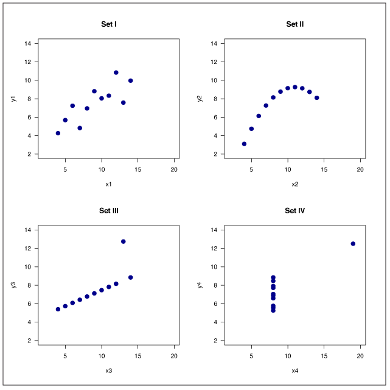

# Linear Regression using Go stats package

This Go program fits a Linear regression model to the Anscombe Quartet dataset. I also compare the results of the model to those created by Python and R codes as well as benchmark the three codes for eficiency comparison.

## Table of Contents
- [Introduction](#introduction)
- [Features](#features)
- [Usage](#usage)
- [Code Explanation](#code-explanation)
- [Analysis](#Analysis)
- [Recommendation](#Recommendation)

## Introduction

The Anscombe Quartet, developed by Anscombe (1973), is a set of four data sets with one independent variable x and one dependent variable y. Simple linear regression of y on x yields identical estimates of regression coefficients despite the fact that these are very different data sets. The Anscombe Quartet provides a telling demonstration of the importance of data visualization. Here is a plot of the four data sets generated from an R program in Miller (2015):



This program utilizes the Go stats package Montana Flynn. You can find information on examples and installation [here](https://github.com/montanaflynn/stats)

## Features

- Analyzes the Anscombe data.
- Has functions to test and benchmark the program

## Installation

1. Make sure you have [Go installed](https://go.dev/doc/install).
2. Clone this repo to your local machine:
    ```bash
    git clone https://github.com/hamodikk/csvToJlConverter.git
    ```
3. Navigate to the project directory
    ```bash
    cd <project-directory>
    ```

## Usage

Use the following command in your terminal or Powershell to run the program:
```bash
go run .\main.go
```

Here is how you can test and benchmark the code:
```bash
# Test the code to compare coefficient of regression between Python and R against the Go code
go test -v

# Benchmark the code to obtain execution times of the Go code
go test -bench=.
```

### Code Explanation

- Create the Anscombe struct
```go
type AnscombeData struct {
	X1, X2, X3, X4 float64
	Y1, Y2, Y3, Y4 float64
}
```
- Create a function to calculate the coefficient of regression from the results of the linear regression function. While the stats.LinearRegression() calculates the gradient, I can't grab the value from the function, so I had to create this function separately.
```go
func CalculateCoefficient(regressiondata []stats.Coordinate) (float64, error) {
	// Handle empty input
	if len(regressiondata) == 0 {
		return 0, fmt.Errorf("empty input")
	}

	// Create the variables
	var sumX, sumY, sumXY, sumXX float64
	n := float64(len(regressiondata))

	// Iterate each element in the collection
	// generated by the linear regression function
	for i := range regressiondata {
		x := regressiondata[i].X
		y := regressiondata[i].Y
		sumX += x
		sumY += y
		sumXY += x * y
		sumXX += x * x
	}

	// Calculate the coefficient
	num := (n * sumXY) - (sumX * sumY)
	den := (n * sumXX) - (sumX * sumX)

	coefficient := num / den
	return coefficient, nil
}
```
- Create the main function. We include the Anscombe Quartet data in the form of stats.Coordinate. The function fits the linear regression with stats.LinearRegression followed by calculating coefficient of regression using CalculateCoefficient()
```go
func main() {
	// Create the Anscombe Quartet data
	c1 := []stats.Coordinate{
		{X: 10, Y: 8.04},
		{X: 8, Y: 6.95},
		{X: 13, Y: 7.58},
		{X: 9, Y: 8.81},
		{X: 11, Y: 8.33},
		{X: 14, Y: 9.96},
		{X: 6, Y: 7.24},
		{X: 4, Y: 4.26},
		{X: 12, Y: 10.84},
		{X: 7, Y: 4.82},
		{X: 5, Y: 5.68},
	}

	c2 := []stats.Coordinate{
		{X: 10, Y: 9.14},
		{X: 8, Y: 8.14},
		{X: 13, Y: 8.74},
		{X: 9, Y: 8.77},
		{X: 11, Y: 9.26},
		{X: 14, Y: 8.10},
		{X: 6, Y: 6.13},
		{X: 4, Y: 3.10},
		{X: 12, Y: 9.13},
		{X: 7, Y: 7.26},
		{X: 5, Y: 4.74},
	}

	c3 := []stats.Coordinate{
		{X: 10, Y: 7.46},
		{X: 8, Y: 6.77},
		{X: 13, Y: 12.74},
		{X: 9, Y: 7.11},
		{X: 11, Y: 7.81},
		{X: 14, Y: 8.84},
		{X: 6, Y: 6.08},
		{X: 4, Y: 5.39},
		{X: 12, Y: 8.15},
		{X: 7, Y: 6.42},
		{X: 5, Y: 5.73},
	}

	c4 := []stats.Coordinate{
		{X: 8, Y: 6.58},
		{X: 8, Y: 5.76},
		{X: 8, Y: 7.71},
		{X: 8, Y: 8.84},
		{X: 8, Y: 8.47},
		{X: 8, Y: 7.04},
		{X: 8, Y: 5.25},
		{X: 19, Y: 12.50},
		{X: 8, Y: 5.56},
		{X: 8, Y: 7.91},
		{X: 8, Y: 6.89},
	}

	// Fit linear regression models
	r1, _ := stats.LinearRegression(c1)
	coefficient1, _ := CalculateCoefficient(r1)
	fmt.Println("Linear Regression series for c1:", r1, "\nCoefficient of Regression:", coefficient1)

	r2, _ := stats.LinearRegression(c2)
	coefficient2, _ := CalculateCoefficient(r2)
	fmt.Println("Linear Regression series for c2:", r2, "\nCoefficient of Regression:", coefficient2)

	r3, _ := stats.LinearRegression(c3)
	coefficient3, _ := CalculateCoefficient(r3)
	fmt.Println("Linear Regression series for c3:", r3, "\nCoefficient of Regression:", coefficient3)

	r4, _ := stats.LinearRegression(c4)
	coefficient4, _ := CalculateCoefficient(r4)
	fmt.Println("Linear Regression series for c4:", r4, "\nCoefficient of Regression:", coefficient4)
}
```

## Analysis

Using the go test -v command we were able to compare the results of the Go code with that from Python and R.

```bash
go test -v
=== RUN   TestCalculateCoefficient
--- PASS: TestCalculateCoefficient (0.00s)
PASS
ok      gostats 0.131s
```

This shows that the test was a success and that our coefficient of regression values are the same as that from Python and R.

Additionally, out benchmarking result shows that fitting the linear regression model on the Anscombe Quartet takes 0.131 seconds with our code. Running similar benchmarks on the Python and R codes shows the following graph (benchmark code for [Python](pythonbenchmark.py) and [R](Rbenchmark.R)):

| Code Language  | Code efficiency (seconds) |
|----------------|---------------------------|
| Go             | 0.131                     |
| R              | 0.014                     |
| Python         | 0.003                     |

## Recommendation

While Go has a lot of utility in backend and database services, comparing the statistics package to other popular statistics languages, Go underperforms. It does provide accurate results for the model that we tested it on. However, in terms of ease of use and efficiency, Python and R are superior.

The package we utilized for the statistical analysis was lacking in providing detailed information about the fit of the linear regression model, requiring additional functions to be implemented. In comparison, Python and R were both able to not only perform the linear regression fit in a very simple way, they required no additional code to provide a summary of the model including the coefficienct of regression.

In terms of efficiency, there is a significant difference between Go and the other two languages. While the dataset we worked with was small in size, the ten-fold and hundred-fold efficiency increase with R and Python respectively means that scaling up to bigger datasets would prove difficult with Go, leading to losing the company a lot of time.

Acknowledging the advantages of Go in certain areas, we still have to advise the company to consider other options when it comes to data analytics purposes. As much as accuracy is not a point of concern with Go, as it has obtained the same results as the other two languages, the execution time and ease of use as well as library availability make Go a non-preferred language for statistical analysis purposes.